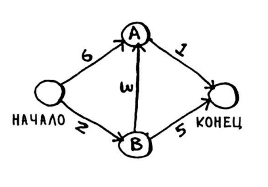
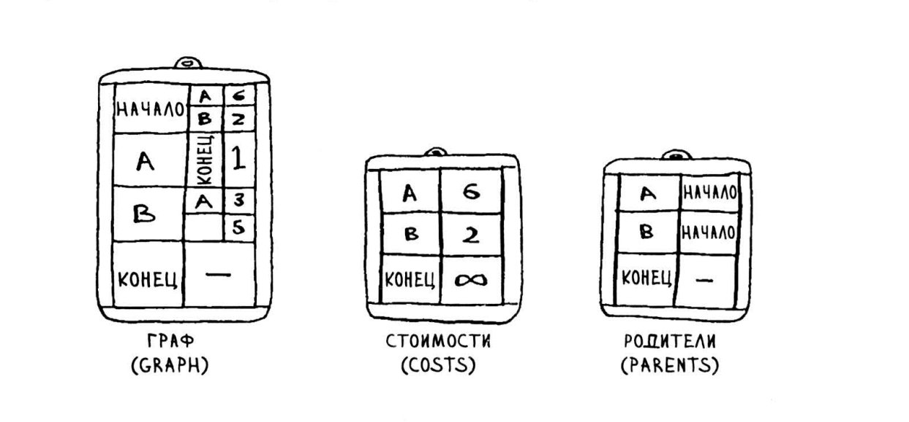
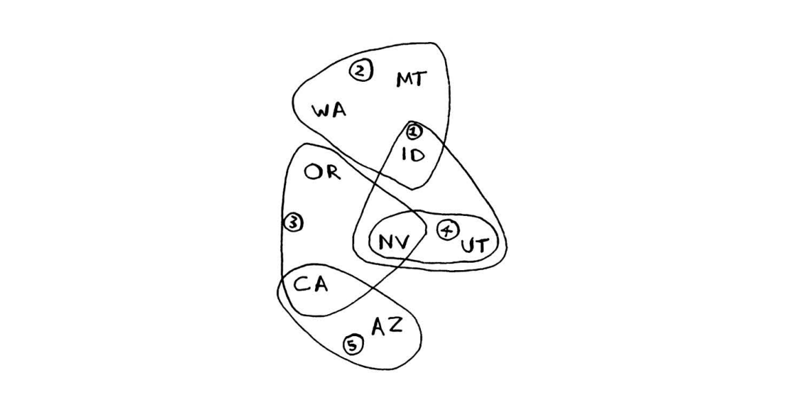
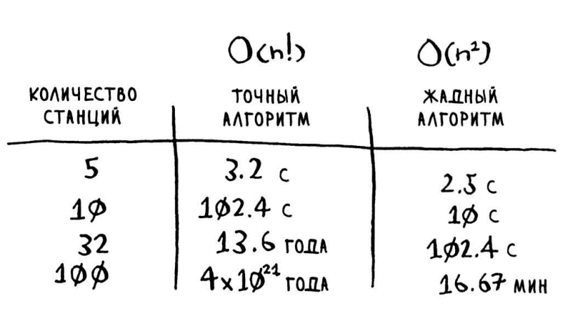

# Grokaem_Algoritms!
## Для понимани структуры алгоритма Дейкстры
#### Задача про самый короткий маршрут

#### Какие словари для этого понадобятся

## Жадные алгоритмы
#### Задача про то как покрыть наибольшее кол-во штатов
#### Не всегда можно достичь идеального результата

### Сравнение ЖАДНОГО и ИДЕАЛЬНОГО алгоритмов

### Жадные алгоритмы стремятся к локальной оптимизации в расчете на то, что в итоге будет достигнут глобальный оптимум. 

### Параллельный алгоритм трудно разработать. И так же трудно убедиться в том, что он работает правильно, и понять, какой прирост скорости он обеспечивает. Одно можно заявить твердо: выигрыш по времени не линеен. 
### Следовательно, если процессор вашего компьютера имеет два ядра вместо одного, из этого не следует, что ваш алгоритм по волшебству заработает вдвое быстрее. Это объясняется несколькими причинами. 
## Затраты ресурсов на управление параллелизмом
## Распределение нагрузки

## Распределенные алгоритмы хорошо работают в тех ситуациях , когда вам 
## нужно выполнить большой объем работы и вы хотите сократить время ее 
## выполнения. В основе технологии MapReduce лежат две простые идеи : 
## функция отображения map и функция свертки reduce. -->